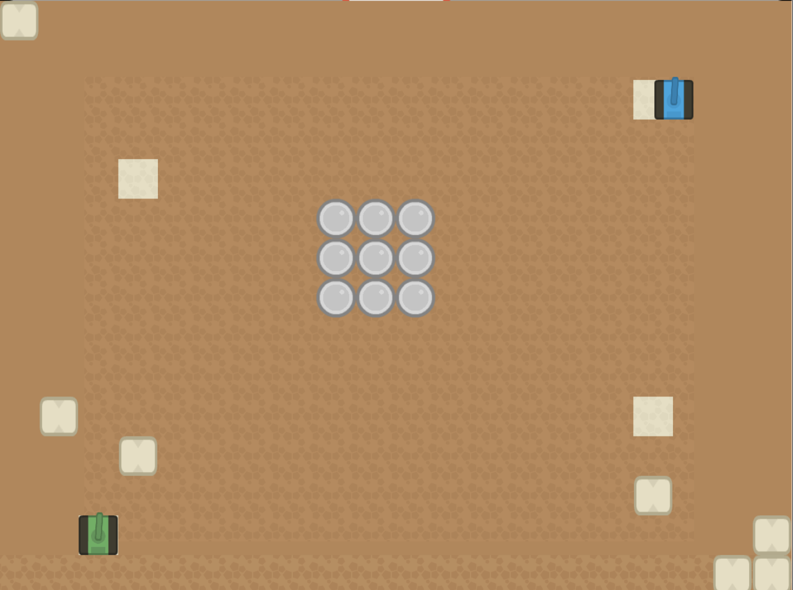

# Getting Started

Welcome to CodeQuest-23!

This year's game is a game of tanks, where two tanks will battle it out in several maps.

Each team is in control of one of the tanks and each tank is allowed to take some given actions in each turn.
Please refer to [Actions](game_logic/actions.md) for more information on actions.

## Game Objects

The game consists of several different objects which interact with each other, for more information on each object, click on the links below.

* [Tank](game_objects/tank.md)
* [Bullet](game_objects/bullet.md)
* [Wall](game_objects/wall.md)
* [DestructibleWall](game_objects/destructibleWall.md)
* [Powerup](game_objects/powerup.md)
* [Boundary](game_objects/boundary.md)

## Communication (I/O)

The game clients (your code) communicate with the game server by sending and receiving json messages through standard input and standard output.

Standard input is where you would receive updates about the game from game server, for example the new position of the enemy tank.
Standard output is where you can in turn choose an action that your tank should take, for example shoot towards the enemy tank.

For more information on communication please see [Communication](game_logic/communication.md).

## Actions

Each time it is your turn in the game, you get to decide what your tank should do, you are given a set of actions that you can choose from such as the "shoot" action. You can find a full list of the available actions and the way they should be communicated in [Actions](game_logic/actions.md).

## Collisions

Different objects in the game react and interact differently to each other. For example a tank bullet would be destroyed when it collides with a wall but it would bounce off the boundary. To see the collision information for all game objects, you can visit [Collisions](game_logic/collisions.md)
